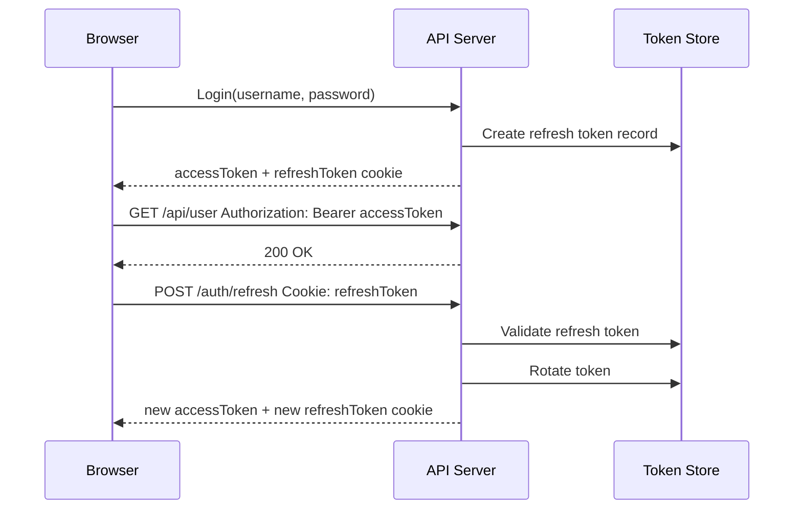

# Cookie、CSRF 与 RefreshToken

这篇笔记把前端鉴权里最容易混淆的三块放在一起：Cookie 属性、CSRF/XSRF 防护，以及 Refresh Token 的刷新机制。

## Cookie 是什么

Cookie 是服务端通过 `Set-Cookie` 响应头写入浏览器的一小段状态数据。之后浏览器在匹配域名、路径、协议、SameSite 等条件时，会自动把 Cookie 放进请求头的 `Cookie` 字段发回服务端。

一个响应可以设置多个 Cookie，但需要发送多个 `Set-Cookie` 响应头：

```http
Set-Cookie: sid=abc123; Path=/; HttpOnly; Secure; SameSite=Lax
Set-Cookie: theme=dark; Path=/; Max-Age=2592000
```

前端 JavaScript 不能直接读取响应里的 `Set-Cookie` 头；如果是跨域 `fetch`/XHR，浏览器还要求请求显式带 credentials，否则会忽略响应中的 `Set-Cookie`。

```ts
fetch('https://api.example.com/profile', {
  credentials: 'include',
});
```

## Set-Cookie 属性总览

| 属性 | 示例 | 作用 | 注意点 |
| --- | --- | --- | --- |
| `name=value` | `sid=abc123` | Cookie 的键和值 | 名称和值有字符限制；复杂值通常需要编码 |
| `Domain` | `Domain=example.com` | 控制哪些 host 会携带该 Cookie | 不设置时是 host-only cookie，只发给当前 host；设置后通常会包含子域名 |
| `Path` | `Path=/admin` | 控制哪些路径会携带该 Cookie | 不是安全边界，不能防止其他路径读取或覆盖敏感 Cookie |
| `Expires` | `Expires=Wed, 21 Oct 2030 07:28:00 GMT` | 绝对过期时间 | 依赖服务端时间；不设置 `Expires`/`Max-Age` 时通常是 session cookie |
| `Max-Age` | `Max-Age=3600` | 相对过期秒数 | 与 `Expires` 同时存在时，`Max-Age` 优先 |
| `HttpOnly` | `HttpOnly` | 禁止 `document.cookie` 读取 | 可降低 XSS 窃取 Cookie 的风险，但 Cookie 仍会随请求自动发送 |
| `Secure` | `Secure` | 仅在 HTTPS 请求中发送 | `SameSite=None` 必须同时设置 `Secure`；localhost 通常有特殊处理 |
| `SameSite` | `SameSite=Lax` | 控制跨站请求是否携带 Cookie | 是 CSRF 防御的纵深手段，不应作为唯一防护 |
| `Partitioned` | `Partitioned; Secure` | CHIPS 分区 Cookie，按顶级站点隔离第三方 Cookie | 必须配合 `Secure`；用于嵌入式/第三方场景 |
| `Priority` | `Priority=High` | Chrome 系浏览器用于 Cookie 淘汰优先级 | 浏览器特定/非标准属性，不建议作为通用能力依赖 |

### SameSite 三种取值

| 值 | 行为 | 典型用途 |
| --- | --- | --- |
| `Strict` | 只在 same-site 请求中发送 Cookie | 高敏感业务，比如后台管理、支付确认页 |
| `Lax` | same-site 请求发送；跨站顶级导航且安全方法通常也发送 | 多数登录态 Cookie 的默认建议 |
| `None` | same-site 和 cross-site 请求都发送 | 第三方嵌入、跨站 SSO；必须同时设置 `Secure` |

`SameSite=Lax` 能挡住很多跨站表单 POST、图片 GET 等 CSRF 场景，但不是完整防线。比如某些顶级导航、同站子域风险、客户端 CSRF、业务误用 GET 改状态等仍需要额外防护。

### Cookie 前缀

Cookie 名称可以使用前缀让浏览器对属性做额外约束：

| 前缀 | 要求 | 适合场景 |
| --- | --- | --- |
| `__Secure-` | 必须通过 HTTPS 设置，并带 `Secure` | 表示该 Cookie 只能从安全上下文设置 |
| `__Host-` | 必须 HTTPS、`Secure`、`Path=/`，且不能设置 `Domain` | 推荐用于主登录态 Cookie，减少子域覆盖风险 |
| `__Http-` | 必须 `Secure` + `HttpOnly`，证明只能由 `Set-Cookie` 设置 | 支持度不如前两个，使用前确认目标浏览器 |
| `__Host-Http-` | 同时满足 `__Host-` 和 `__Http-` 的约束 | 更严格的 host-only HTTP-only Cookie |

推荐的会话 Cookie：

```http
Set-Cookie: __Host-sid=opaque-session-id; Path=/; HttpOnly; Secure; SameSite=Lax
```

删除 Cookie 时，`Domain` 和 `Path` 要与设置时匹配，否则可能删不到原 Cookie：

```http
Set-Cookie: __Host-sid=; Path=/; Max-Age=0; HttpOnly; Secure; SameSite=Lax
```

## Cookie 常见配置方案

### 传统 Session Cookie

服务端保存 session，浏览器只保存不可猜测的 session id：

```http
Set-Cookie: __Host-sid=s%3Aopaque-session-id; Path=/; HttpOnly; Secure; SameSite=Lax
```

优点是服务端可控、可撤销；缺点是需要服务端存储 session 或集中式 session 存储。

### Access Token + Refresh Token Cookie

常见做法：

- access token 短期有效，用于访问 API。
- refresh token 长期有效，只用于换新 access token。
- refresh token 放在 `HttpOnly; Secure; SameSite=Lax/Strict` Cookie 中，降低被 JavaScript 读取的风险。
- access token 可放内存中，减少 XSS 后长期泄露风险。

```http
Set-Cookie: __Host-refresh=opaque-refresh-token; Path=/auth/refresh; HttpOnly; Secure; SameSite=Lax; Max-Age=1209600
```

`Path=/auth/refresh` 可以减少 refresh token 被发送到其他 API 的机会，但它不是安全边界；真正的安全仍依赖服务端校验、轮换、撤销和日志。

### 跨站请求 Cookie

如果前端和后端是跨站点，例如 `app.example.com` 请求 `api.example.net`，需要：

```http
Set-Cookie: sid=abc123; Path=/; HttpOnly; Secure; SameSite=None
```

前端请求：

```ts
fetch('https://api.example.net/user', {
  credentials: 'include',
});
```

服务端 CORS 不能使用 `Access-Control-Allow-Origin: *` 配合 credentials，必须显式允许可信 origin：

```http
Access-Control-Allow-Origin: https://app.example.com
Access-Control-Allow-Credentials: true
```

## CSRF 是什么

CSRF（Cross-Site Request Forgery）利用的是“浏览器会自动带上目标站点 Cookie”的行为。

一个攻击成立通常需要三个条件：

1. 服务端用 Cookie 判断用户身份。
2. 某个请求会修改服务端状态，比如转账、改密码、删除资源。
3. 请求参数攻击者可以构造，并且服务端没有额外校验请求来源或 CSRF token。

攻击页可以构造表单或图片请求，让已登录用户的浏览器向目标站点发请求。即使攻击者读不到响应，状态改变也可能已经发生。

```html
<form action="https://bank.example/transfer" method="POST">
  <input type="hidden" name="to" value="attacker" />
  <input type="hidden" name="amount" value="1000" />
</form>
<script>
  document.querySelector('form').submit();
</script>
```

## 为什么请求头设置 xsrfToken 可以防 CSRF

前端项目里常见配置：

```ts
import axios from 'axios';

axios.defaults.withCredentials = true;
axios.defaults.xsrfCookieName = 'XSRF-TOKEN';
axios.defaults.xsrfHeaderName = 'X-XSRF-TOKEN';
```

或者手写拦截器：

```ts
axios.interceptors.request.use(config => {
  const token = document.cookie
    .split('; ')
    .find(item => item.startsWith('XSRF-TOKEN='))
    ?.split('=')[1];

  if (token && !/^(GET|HEAD|OPTIONS|TRACE)$/i.test(config.method || 'GET')) {
    config.headers['X-XSRF-TOKEN'] = decodeURIComponent(token);
  }

  return config;
});
```

它能防 CSRF 的核心不是“header 名字叫 xsrfToken”，而是这几个约束叠加：

1. 浏览器会自动携带认证 Cookie，所以攻击页面可以“借用登录态”发请求。
2. 但攻击页面不能读取目标站点的 `XSRF-TOKEN` Cookie，因为同源策略限制了 `document.cookie`。
3. 攻击页面也不能随意发送带自定义 header 的跨域请求而绕过服务端，因为自定义 header 会触发 CORS preflight。
4. 服务端只允许可信 origin 通过 preflight，并校验 `X-XSRF-TOKEN` 与服务端记录或 Cookie 中的 token 是否匹配。
5. 攻击者能让浏览器带上 Cookie，却很难同时带上正确的自定义 XSRF header。

也就是说，请求头防护依赖的是“同源可读 token + 自定义 header + 服务端校验 + 严格 CORS”，不是单纯依赖 header 存在。

### Double Submit Cookie 模式

SPA 常见的 cookie-to-header 模式通常是 Double Submit Cookie 的变体：

```http
Set-Cookie: XSRF-TOKEN=random-csrf-token; Path=/; Secure; SameSite=Lax
Set-Cookie: __Host-sid=opaque-session-id; Path=/; HttpOnly; Secure; SameSite=Lax
```

前端读取非 `HttpOnly` 的 `XSRF-TOKEN`，把它放入 header：

```http
X-XSRF-TOKEN: random-csrf-token
```

服务端校验：

```ts
function csrfGuard(req, res, next) {
  const cookieToken = req.cookies['XSRF-TOKEN'];
  const headerToken = req.get('X-XSRF-TOKEN');

  if (!cookieToken || !headerToken || cookieToken !== headerToken) {
    return res.status(403).json({ message: 'Invalid CSRF token' });
  }

  next();
}
```

更严谨的实现应该使用 signed double-submit cookie：CSRF token 与 session id 或用户态绑定，并使用 HMAC 签名，避免攻击者通过可控子域写入同名 Cookie 后伪造匹配关系。

### 服务端还应该做什么

- 所有会改变状态的接口拒绝 GET。
- 校验 `Origin` 或 `Referer`，作为额外防线。
- 使用 `SameSite=Lax` 或 `SameSite=Strict`。
- 对 JSON API 拒绝 `application/x-www-form-urlencoded`、`multipart/form-data`、`text/plain` 等 simple content-type，降低简单请求绕过空间。
- CORS credentials 模式下只允许明确的可信 origin，不允许 `*`。
- 高风险操作增加二次确认、重新认证或 WebAuthn。

## Refresh Token 原理

Refresh Token 的目标是解决“access token 应该短，但用户不应该频繁登录”的矛盾。

基本模型：

1. 用户登录成功后，服务端返回短期 access token 和较长期 refresh token。
2. 前端访问业务 API 时使用 access token。
3. access token 过期后，前端调用刷新接口，携带 refresh token。
4. 服务端校验 refresh token，如果有效，签发新的 access token。
5. 用户退出、改密码、检测到风险时，服务端撤销 refresh token。



### 为什么 refresh token 要轮换

长期 refresh token 一旦泄露，攻击者可以持续换取新的 access token。OAuth 2.0 安全最佳实践要求 public client 使用 sender-constrained refresh token 或 refresh token rotation。

Refresh Token Rotation 的规则：

- 每次刷新都签发一个新的 refresh token。
- 旧 refresh token 立即失效。
- 服务端保留 token family 或 parent/child 关系。
- 如果旧 refresh token 被再次使用，说明可能发生泄露；服务端撤销该 token family，要求用户重新登录。

这样即使 refresh token 被偷，攻击者和合法客户端只要有一方使用了旧 token，服务端就能检测到复用。

## Refresh Token 实现示例

### 数据表设计

```sql
CREATE TABLE refresh_tokens (
  id              VARCHAR(64) PRIMARY KEY,
  user_id         VARCHAR(64) NOT NULL,
  token_hash      VARCHAR(128) NOT NULL,
  family_id       VARCHAR(64) NOT NULL,
  parent_id       VARCHAR(64),
  expires_at      TIMESTAMP NOT NULL,
  revoked_at      TIMESTAMP NULL,
  replaced_by     VARCHAR(64),
  created_at      TIMESTAMP NOT NULL,
  last_used_at    TIMESTAMP NULL
);
```

只保存 refresh token 的 hash，不保存明文 token。明文 token 只返回给客户端一次。

### 登录签发

```ts
async function login(user) {
  const accessToken = signAccessToken({
    sub: user.id,
    exp: Math.floor(Date.now() / 1000) + 15 * 60,
  });

  const refreshToken = randomToken();
  const tokenId = randomId();
  const familyId = randomId();

  await db.refreshTokens.insert({
    id: tokenId,
    user_id: user.id,
    token_hash: hash(refreshToken),
    family_id: familyId,
    expires_at: addDays(new Date(), 14),
    created_at: new Date(),
  });

  return { accessToken, refreshToken };
}
```

响应：

```http
Set-Cookie: __Host-refresh=<refresh-token>; Path=/auth/refresh; HttpOnly; Secure; SameSite=Lax; Max-Age=1209600
```

### 刷新接口

```ts
async function refresh(req, res) {
  const oldToken = req.cookies['__Host-refresh'];
  if (!oldToken) return res.sendStatus(401);

  const record = await db.refreshTokens.findByHash(hash(oldToken));
  if (!record || record.expires_at < new Date()) {
    return res.sendStatus(401);
  }

  if (record.revoked_at) {
    await revokeTokenFamily(record.family_id);
    return res.sendStatus(401);
  }

  const newRefreshToken = randomToken();
  const newTokenId = randomId();

  await db.transaction(async tx => {
    await tx.refreshTokens.update(record.id, {
      revoked_at: new Date(),
      replaced_by: newTokenId,
      last_used_at: new Date(),
    });

    await tx.refreshTokens.insert({
      id: newTokenId,
      user_id: record.user_id,
      token_hash: hash(newRefreshToken),
      family_id: record.family_id,
      parent_id: record.id,
      expires_at: addDays(new Date(), 14),
      created_at: new Date(),
    });
  });

  const accessToken = signAccessToken({
    sub: record.user_id,
    exp: Math.floor(Date.now() / 1000) + 15 * 60,
  });

  res.cookie('__Host-refresh', newRefreshToken, {
    httpOnly: true,
    secure: true,
    sameSite: 'lax',
    path: '/auth/refresh',
    maxAge: 14 * 24 * 60 * 60 * 1000,
  });

  return res.json({ accessToken });
}
```

### 前端无感刷新

```ts
let accessToken = '';
let refreshPromise: Promise<string> | null = null;

async function refreshAccessToken() {
  const res = await fetch('/auth/refresh', {
    method: 'POST',
    credentials: 'include',
    headers: {
      'X-XSRF-TOKEN': getXsrfToken(),
    },
  });

  if (!res.ok) throw new Error('refresh failed');

  const data = await res.json();
  accessToken = data.accessToken;
  return accessToken;
}

axios.interceptors.response.use(undefined, async error => {
  const original = error.config;

  if (error.response?.status !== 401 || original._retry) {
    throw error;
  }

  original._retry = true;
  refreshPromise ||= refreshAccessToken().finally(() => {
    refreshPromise = null;
  });

  const token = await refreshPromise;
  original.headers.Authorization = `Bearer ${token}`;
  return axios(original);
});
```

关键点：

- 用单例 `refreshPromise` 合并并发 401，避免多个请求同时刷新导致 refresh token 轮换冲突。
- refresh 接口本身也要做 CSRF 防护，因为 refresh token 放在 Cookie 里会被浏览器自动携带。
- access token 尽量短期有效，refresh token 需要服务端可撤销。
- logout 时同时清 Cookie、撤销当前 token family。

## 实战推荐配置

### 同站点 Web 应用

```http
Set-Cookie: __Host-sid=<session>; Path=/; HttpOnly; Secure; SameSite=Lax
Set-Cookie: XSRF-TOKEN=<csrf-token>; Path=/; Secure; SameSite=Lax
```

- session/refresh token 使用 `HttpOnly`。
- XSRF token 不设置 `HttpOnly`，让前端能读取并放到 header。
- 服务端校验 `Origin` + `X-XSRF-TOKEN`。

### 跨站点 API

```http
Set-Cookie: __Host-refresh=<refresh-token>; Path=/auth/refresh; HttpOnly; Secure; SameSite=None
```

- 前端请求必须 `credentials: 'include'`。
- 服务端 CORS 必须显式白名单 origin，并设置 `Access-Control-Allow-Credentials: true`。
- `SameSite=None` 不是“更安全”，只是允许跨站发送；必须补齐 CSRF token、Origin 校验和严格 CORS。

## 参考资料

- [MDN: Set-Cookie header](https://developer.mozilla.org/en-US/docs/Web/HTTP/Reference/Headers/Set-Cookie)
- [MDN: Cross-site request forgery](https://developer.mozilla.org/en-US/docs/Web/Security/Attacks/CSRF)
- [OWASP: Cross-Site Request Forgery Prevention Cheat Sheet](https://cheatsheetseries.owasp.org/cheatsheets/Cross-Site_Request_Forgery_Prevention_Cheat_Sheet.html)
- [RFC 9700: Best Current Practice for OAuth 2.0 Security](https://datatracker.ietf.org/doc/html/rfc9700)
- [Auth0: Refresh Token Rotation](https://auth0.com/docs/secure/tokens/refresh-tokens/refresh-token-rotation)
