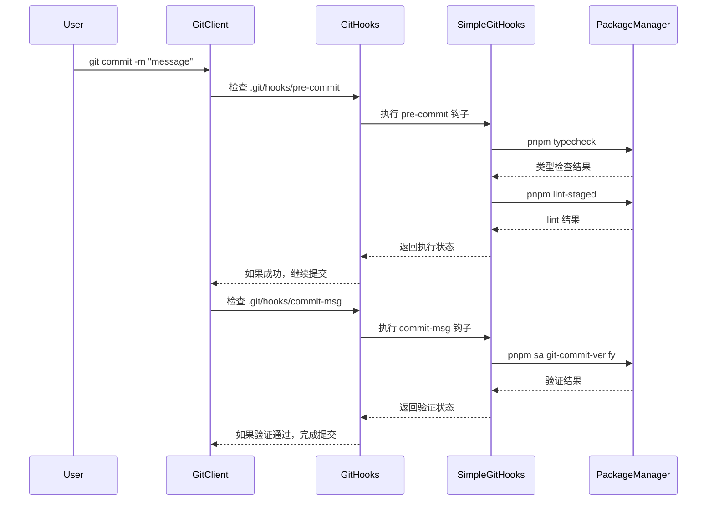
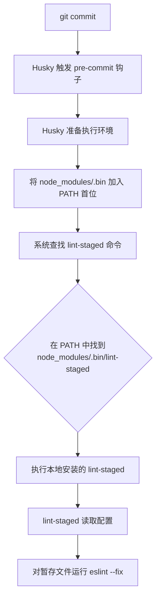

# 文档


[bookmark](https://npm.nodejs.cn/cli/v9/commands/npm-install)


# **`dedupe`** **命令（npm/pnpm 通用）**

- **作用**：整理依赖树，合并重复依赖包，减少项目体积
- **用法**：

    **bash**


    `npm dedupe  # npm 整理依赖 
     pnpm dedupe  # pnpm 整理依赖（等价于 pnpm prune）`

- **原理**：分析 `node_modules` 中的重复包，通过符号链接或版本兼容策略合并，优化依赖结构

# node版本工具：nvm


`nvm ls`


`nvm use <20.x.x>`


# **registry管理工具： nrm**


`nrm ls`


`nrm use <xxx>`


# workspace


[bookmark](https://ksh7.com/posts/pnpm-use-workspace/)


[embed](https://ksh7.com/posts/pnpm-use-workspace/)


### 总结对比


| 特性         | **npm**        | **pnpm**        |
| ---------- | -------------- | --------------- |
| **磁盘空间**   | 包重复存储，占用更多空间   | 使用符号链接，减少重复存储   |
| **依赖安装速度** | 安装速度较慢，特别是大项目  | 更快，减少磁盘读取和文件复制  |
| **依赖管理**   | 松散的依赖树结构，允许多版本 | 更严格的依赖管理，避免版本冲突 |
| **工作区支持**  | 支持工作区，但性能可能较差  | 高效的工作区支持，性能优越   |
| **缓存机制**   | 不共享缓存，重复下载依赖   | 使用全局缓存，避免重复下载   |
| **去重机制**   | 去重较弱，可能有重复的包   | 更强的去重机制，避免重复包   |
| **CLI 命令** | 与 pnpm 类似，已熟悉  | 与 npm 类似，易于迁移   |


## pnpm中硬链接和软链接

- **硬链接**：主要用于 **不同项目之间共享全局缓存中的依赖文件**。避免多个项目重复存储相同版本的依赖包，节省磁盘空间。多个项目通过硬链接指向全局缓存中的同一个包文件，减少存储开销。
- **软链接**：主要用于 **在项目内部构建** **`node_modules`** **目录结构**。它们帮助 `pnpm` 实现依赖的正确解析，特别是处理嵌套依赖和实现扁平化结构，使得项目能够正确找到和使用依赖。

`pnpm`依赖关系


    <u>**a**</u>(`node_modules\.pnpm\bcryptjs@2.4.3\node_modules\bcryptjs\package.json`)


    <u>**b**</u>(`node_modules\bcryptjs\package.json`)（符号链接）关系


    项目package.json中所有包都在node_modules下类似 **b** 包，


    包存储地址是通过软链接（符号链接）到 .pnpm下的 **a** 包，物理地址是 **a** 包硬链接的磁盘地址


    


    


    一个包的不同版本是如何处理的：


    


    包中的依赖是如何处理的


    


    


    


# npm install & npm ci


`npm install` 和 `npm ci` 是 npm 中用于管理项目依赖的核心命令，二者在功能、使用场景等方面存在差异，具体如下：


### 1. `npm install`（常用缩写 `npm i`）

- **功能**：
依据项目根目录的 `package.json` 安装依赖，若存在 `package-lock.json` 或 `npm-shrinkwrap.json`，会尽量按锁文件记录的版本安装；若没有锁文件，会下载满足 `package.json` 语义化版本范围（如 `^1.2.3` ）的最新兼容版本 。
还可用于**添加、更新、删除依赖**（如 `npm install <包名>` 新增依赖，`npm install <包名>@<版本>` 更新依赖 ），执行时可能更新 `package-lock.json` 以同步实际安装的版本。
- **使用场景**：
开发过程中频繁使用，比如新项目初始化（首次拉取代码后安装所有依赖 ）、添加新依赖（如引入 `lodash` 库 ）、更新已有依赖版本（如把 `axios` 从 `0.21.0` 更到 `1.0.0` ）等场景。
- **示例**：

    ```shell
    # 安装 package.json 中所有依赖
    npm install
    # 安装 lodash 包并添加到 dependencies
    npm install lodash
    # 安装指定版本的 axios 包
    npm install axios@1.0.0
    ```


### 2. `npm ci`

- **功能**：
专为自动化环境（如持续集成 CI、测试平台、部署流程 ）设计，**严格依据** **`package-lock.json`** **或** **`npm-shrinkwrap.json`** **安装依赖**。若 `package.json` 里的依赖版本和锁文件不匹配，会直接报错退出，不会尝试更新锁文件；安装前会自动删除现有 `node_modules` 目录，保证安装的依赖干净、一致；且**无法用于添加单个依赖**，安装过程“冻结”，不会修改 `package.json` 和锁文件 。
- **使用场景**：
用于对依赖一致性要求极高的场景，像 CI/CD 流水线（保证每次构建使用相同版本依赖，避免因依赖差异导致构建/测试失败 ）、生产环境部署（确保线上运行依赖与测试验证过的版本完全一致 ）等。
- **示例**：

    ```shell
    # 基于锁文件安装所有依赖，安装前会删除现有 node_modules
    npm ci
    ```


### 3. 核心区别总结


| **对比维度**                  | `npm install`                        | `npm ci`                                              |
| ------------------------- | ------------------------------------ | ----------------------------------------------------- |
| **依赖安装依据**                | 优先参考锁文件，无锁文件则按 `package.json` 语义化版本装 | 严格依据锁文件（`package-lock.json`/`npm-shrinkwrap.json` ）安装 |
| **锁文件修改**                 | 可能更新锁文件（同步实际安装的依赖版本 ）                | 永远不会修改锁文件和 `package.json`                             |
| **使用灵活性**                 | 可安装单个依赖、更新依赖等                        | 只能安装整个项目依赖，无法添加/更新单个依赖                                |
| **`node_modules`** **处理** | 不会自动删除现有 `node_modules`              | 安装前自动删除现有 `node_modules`                              |
| **版本冲突处理**                | 尝试解决版本不匹配问题（可能更新锁文件 ）                | 版本不匹配直接报错，不尝试解决                                       |
| **典型使用场景**                | 开发时添加/更新依赖、新项目初始化等                   | CI/CD 流程、生产环境部署等对依赖一致性要求高的场景                          |


实际项目中，开发阶段常用 `npm install` 灵活管理依赖，而在自动化构建、部署等环节，为保障环境一致，会优先选用 `npm ci` 。


# Git Hooks 触发机制详解：`simple-git-hooks` 如何工作


package.json文件配置：


```json
"scripts": {
    
    "lint": "eslint . --fix",
    "prepare": "simple-git-hooks",
    "typecheck": "vue-tsc --noEmit --skipLibCheck"
  },
	"simple-git-hooks": {
    "commit-msg": "pnpm sa git-commit-verify",
    "pre-commit": "pnpm typecheck && pnpm lint-staged"
  },
  "lint-staged": {
    "*": "eslint --fix"
  },
```


当执行 `git commit` 时，`simple-git-hooks` 的触发过程是一个精心设计的自动化流程。下面我将详细解释这个机制：


## 完整触发流程





## 关键步骤详解


### 1. 安装阶段：`prepare` 脚本执行


当运行 `pnpm install` 或 `npm install` 时：


```json
"scripts": {
  "prepare": "simple-git-hooks"
}
```

- `simple-git-hooks` 工具会：
    1. 读取 `package.json` 中的 `"simple-git-hooks"` 配置
    2. 在 `.git/hooks` 目录创建钩子文件：
        - `pre-commit`
        - `commit-msg`
    3. 将配置的命令写入这些文件

### 2. pre-commit 钩子文件内容（示例）


`.git/hooks/pre-commit` 文件内容：


```shell
#!/bin/sh
# Generated by simple-git-hooks
pnpm typecheck && pnpm lint-staged
```


### 3. commit-msg 钩子文件内容（示例）


`.git/hooks/commit-msg` 文件内容：


```shell
#!/bin/sh
# Generated by simple-git-hooks
pnpm sa git-commit-verify "$1"
```


### 4. 执行 `git commit` 时的流程

1. **触发 pre-commit 阶段**：
    - Git 查找 `.git/hooks/pre-commit` 文件
    - 执行文件中的命令：`pnpm typecheck && pnpm lint-staged`
    - 如果任一命令失败（返回非0状态码），提交中止
2. **执行 lint-staged**：

    ```json
    "lint-staged": {
      "*": "eslint --fix"
    }
    ```

    - 对暂存区所有文件运行 `eslint --fix`
    - 自动修复可修复的错误
    - 如果有无法自动修复的错误，终止提交
3. **触发 commit-msg 阶段**：
    - 当 pre-commit 通过后
    - Git 查找 `.git/hooks/commit-msg` 文件
    - 执行 `pnpm sa git-commit-verify` 并传递提交消息文件路径
    - 验证提交消息格式（如 Conventional Commits）
    - 如果验证失败，提交中止

## 技术要点总结

1. **自动化安装**：
    - `prepare` 脚本确保每次安装依赖时钩子配置都会更新
2. **隔离执行环境**：
    - 钩子在独立的 shell 环境中执行
    - 使用项目本地的 pnpm（通过 `pnpm run`）
3. **错误处理机制**：

    ```shell
    # pre-commit 实际执行逻辑
    pnpm typecheck
    if [ $? -ne 0 ]; then
      echo "Type check failed!"
      exit 1
    fi
    
    pnpm lint-staged
    if [ $? -ne 0 ]; then
      echo "Linting failed!"
      exit 1
    fi
    ```

4. **性能优化**：
    - 只对暂存文件（`git add` 的文件）进行检查
    - 避免全量检查提高速度

## 实际开发中的行为


当开发者尝试提交：


```shell
$ git commit -m "feat: add new module"
```


控制台输出示例：


```plain text
> Running pre-commit hook
$ pnpm typecheck
✔ No type errors found

$ pnpm lint-staged
✔ eslint --fix applied to 2 files

> Running commit-msg hook
$ pnpm sa git-commit-verify
✔ Commit message follows Conventional Commits

[main 3a8b7d2] feat: add new module
 2 files changed, 45 insertions(+)
```


如果验证失败：


```plain text
> Running pre-commit hook
$ pnpm typecheck
✖ Found 3 type errors

Pre-commit hook failed (add --no-verify to bypass)
```


# `lint-staged` 配置


```json
// 第一种
	"husky": {
    "hooks": {
      "commit-msg": "commitlint -E HUSKY_GIT_PARAMS",
      "pre-commit": "lint-staged"
    }
  },
  "lint-staged": {
    "./packages/app/src/**/*.{js,vue}": [
      "prettier --write"
    ]
  }
  
 // 第二种
	"simple-git-hooks": {
    "commit-msg": "pnpm sa git-commit-verify",
    "pre-commit": "pnpm typecheck && pnpm lint-staged"
  },
  "lint-staged": {
    "*": "eslint --fix"
  },
```

> **`pnpm lint-staged 等同于npx lint-staged`**

## 为什么可以直接在 Husky 配置中使用 `"pre-commit": "lint-staged"`


在 Husky 配置中直接使用 `"pre-commit": "lint-staged"` 而无需指定 `pnpm` 或 `npx` 前缀，这背后有精妙的设计原理。这是 Node.js 生态中**模块解析机制**和**执行环境优化**共同作用的结果：


## 核心机制解析


### 1. PATH 环境变量的魔法


当 Husky 执行钩子命令时，它会自动将项目的 `node_modules/.bin` 目录**前置**到系统 PATH 环境变量中：


```shell
# 实际执行环境类似：
PATH="./node_modules/.bin:$PATH" lint-staged
```


这样系统会优先在本地项目的 `node_modules/.bin` 中查找 `lint-staged` 可执行文件。


### 2. .bin 目录的特殊性


`node_modules/.bin` 目录包含所有安装依赖的**软链接可执行文件**：


```shell
# 项目目录示例
node_modules/
  ├── .bin/
  │   ├── lint-staged → ../lint-staged/bin/lint-staged.js
  │   ├── eslint → ../eslint/bin/eslint.js
  │   └── ...
  ├── lint-staged/
  └── ...
```


### 3. Husky 的执行上下文


Husky 在运行钩子命令时，会确保：

- 当前工作目录是项目根目录
- Node.js 可执行环境已配置
- `node_modules/.bin` 在 PATH 最优先位置

## 完整执行流程





## 技术优势分析


### 直接使用 `lint-staged` 的好处

1. **版本一致性**

    始终使用项目本地安装的特定版本（避免全局版本冲突）

2. **零配置**

    无需在 `package.json` 的 scripts 中重复定义

3. **跨平台兼容**

    在 Windows/macOS/Linux 上行为一致

4. **性能优化**

    避免额外进程创建开销（相比 `pnpm lint-staged` 少一个进程）


### 对比其他调用方式


| 调用方式                    | 进程数 | 版本控制 | 启动速度  | 适用场景        |
| ----------------------- | --- | ---- | ----- | ----------- |
| `lint-staged`           | 1   | ✅ 本地 | ⚡️ 最快 | Git 钩子      |
| `npx lint-staged`       | 2   | ✅ 本地 | 中等    | 临时执行        |
| `pnpm exec lint-staged` | 2   | ✅ 本地 | 中等    | 脚本中调用       |
| `pnpm lint-staged`      | 2   | ✅ 本地 | 较慢    | 需要 pnpm 环境  |
| 全局安装的 `lint-staged`     | 1   | ❌ 全局 | 快     | 不推荐（版本冲突风险） |


## 为什么这样设计是安全的？

1. **隔离性**

    每个项目有自己的 `node_modules/.bin`，互不干扰

2. **确定性**

    `package-lock.json`/`pnpm-lock.yaml` 确保依赖版本一致

3. **可追溯性**

    所有执行文件都来自 `node_modules` 目录

4. **安全边界**

    执行权限限制在项目目录内


## 实际应用场景


### 1. 推荐配置方式


```json
// package.json
{
  "husky": {
    "hooks": {
      "pre-commit": "lint-staged"
    }
  },
  "lint-staged": {
    "*.{js,ts,vue}": "eslint --fix"
  }
}
```


### 2. 复杂场景扩展


```json
"pre-commit": "lint-staged && cross-env NODE_ENV=test vitest run"
```


### 3. 调试技巧


```shell
# 查看实际执行路径
HUSKY_DEBUG=1 git commit

# 输出示例：
[husky] debug: PATH: /project/node_modules/.bin:/usr/bin:/bin
[husky] debug: Running command: lint-staged
```


## 总结


Husky 能直接执行 `lint-staged` 是因为它精心设计了执行环境，通过动态修改 PATH 环境变量，使系统能**自动发现并优先使用**项目本地安装的 `node_modules/.bin/lint-staged`。这种设计体现了 Node.js 生态的模块化哲学：保持配置简洁，依赖本地化，同时确保执行环境的确定性。


这种机制不仅适用于 `lint-staged`，也适用于所有安装在 `devDependencies` 中且提供 CLI 接口的工具（如 `eslint`、`prettier`、`jest` 等），是现代化前端工程的标准实践。


# pnpm Workspace 配置速查表


适用于 monorepo（多包仓库）场景，按「功能分类」整理，聚焦「核心作用+实际场景+避坑点」，方便快速查阅。


## 一、Workspace 范围定义


| 配置项        | 核心作用                | 关键细节/场景                                                                                     | 注意事项                                          |
| ---------- | ------------------- | ------------------------------------------------------------------------------------------- | --------------------------------------------- |
| `packages` | 划定 monorepo 管理的目录范围 | 示例：<br>- `packages/*`：核心子包（如 `packages/vite`）<br>- `playground/**`：示例/调试项目<br>- `docs`：文档目录 | 路径支持通配符（`*` 单级，`**` 多级），需包含子包的 `package.json` |


## 二、依赖管理优化


| 配置项                                   | 核心作用                           | 关键细节/场景                                                                                    | 注意事项                                        |
| ------------------------------------- | ------------------------------ | ------------------------------------------------------------------------------------------ | ------------------------------------------- |
| `hoistPattern`                        | 提升依赖到根目录 `node_modules`，实现多包共享 | 示例：<br>- `postcss`：Vite 核心包与插件共享<br>- `eslint-import-resolver-*`：ESLint 插件共享依赖             | 避免过度提升（如业务依赖），防止版本冲突                        |
| `autoInstallPeers`                    | 控制是否自动安装 peer 依赖               | - `true`：自动补全 peer 依赖（适合快速开发）<br>- `false`：手动声明（适合精确控制版本）                                  | ✅ 推荐大型项目设 `false`，避免自动安装导致版本不兼容             |
| `dedupeInjectedDeps`                  | 控制注入依赖（如插件动态注入）是否去重            | - `true`：强制合并相同版本依赖<br>- `false`：允许多版本共存（如不同插件需不同 `esbuild` 版本）                            | 仅影响「动态注入的依赖」，不影响手动声明的依赖                     |
| `overrides`                           | 强制所有子包使用指定版本的依赖                | 示例：<br>- `vite: 'workspace:*'`：所有包用本地 `packages/vite` 版本<br>- `rolldown: $rolldown`：用本地别名包 | 优先级最高，会覆盖子包自身 `package.json` 的依赖版本          |
| `peerDependencyRules.allowedVersions` | 放宽 peer 依赖版本校验                 | 示例：`vite: "*"`：允许任何版本的 Vite 作为 peer 依赖                                                     | 避免因「peer 版本不匹配」报错，适合兼容多版本场景（如插件支持 Vite 4/5） |


## 三、脚本与构建效率


| 配置项                        | 核心作用         | 关键细节/场景                                              | 注意事项                           |
| -------------------------- | ------------ | ---------------------------------------------------- | ------------------------------ |
| `shellEmulator`            | 启用跨平台脚本模拟器   | 解决 Windows/Mac/Linux 脚本兼容性（如 `rm -rf` 自动转 `rd /s/q`） | 无需手动写跨平台脚本（如 `cross-env`），简化配置 |
| `ignoredBuiltDependencies` | 构建时跳过无需处理的依赖 | 示例：`core-js`（预构建 polyfill）、`es5-ext`（ES5 工具库）        | 仅跳过「无需二次构建的依赖」，避免影响功能          |
| `onlyBuiltDependencies`    | 仅对指定依赖进行构建处理 | 示例：<br>- `esbuild`（需编译二进制）<br>- `sharp`（图像处理原生模块）    | 仅包含「特殊构建需求的依赖」，大幅提升构建速度        |


## 四、依赖补丁与扩展


| 配置项                   | 核心作用                  | 关键细节/场景                                            | 注意事项                         |
| --------------------- | --------------------- | -------------------------------------------------- | ---------------------------- |
| `patchedDependencies` | 给第三方依赖打补丁（无需 fork 源码） | 示例：`"sirv@3.0.2": "patches/sirv@3.0.2.patch"`      | 补丁文件需用 `pnpm patch` 生成，确保兼容性 |
| `packageExtensions`   | 补充第三方包缺失的依赖配置         | 示例：给 `sass-embedded` 补 `source-map-js` 为可选 peer 依赖 | 仅用于修复「第三方包依赖声明不全」的问题，不建议滥用   |


## 五、常用特殊语法说明


| 语法            | 作用                   | 示例                                                     |
| ------------- | -------------------- | ------------------------------------------------------ |
| `workspace:*` | 引用 workspace 内包的最新版本 | `dependencies: { "vite": "workspace:*" }`              |
| `$<包别名>`      | 引用本地定义的包别名           | `overrides: { "rolldown": $rolldown }`（需提前配置别名）        |
| `*`（通配符）      | 匹配任意版本/路径            | `peerDependencyRules.allowedVersions: { "vite": "*" }` |
| `**`（多级通配符）   | 匹配多级目录               | `packages: ["playground/**"]`（匹配 `playground` 下所有子目录）  |

