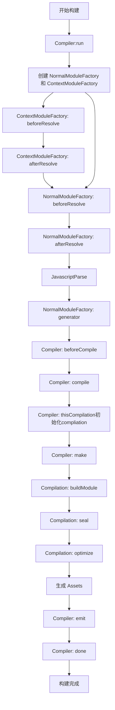
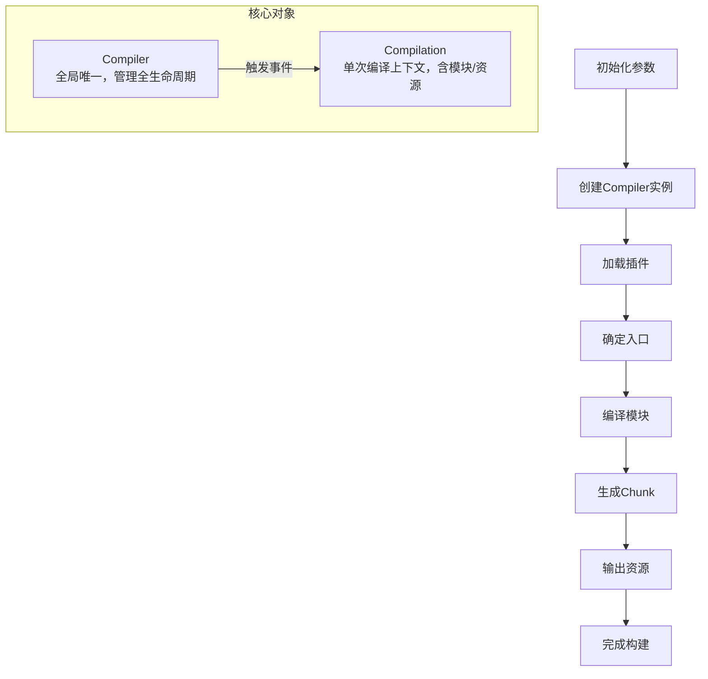
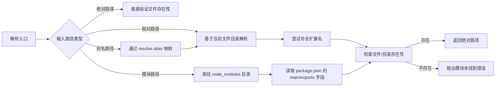
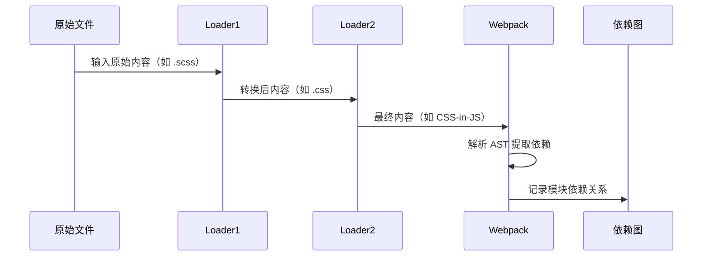

## webpack原理

> 参考文档：[Webpack原理深度剖析](https://segmentfault.com/a/1190000015088834#item-4)

## 执行流程





## 模块联邦


> 💡 **模块联邦示例**  
> [https://github.com/kavience/module-federation-demo](https://github.com/kavience/module-federation-demo)

1. **hash**:
    - `hash` 是在整个构建过程中生成的一个单一的哈希值。当你修改项目中的任何一个文件时，所有输出文件的哈希值都会改变。这是因为整个构建的上下文改变了，即使大多数文件内容实际上并没有变化。这种方式适用于那些需要所有资源一起重新加载的场景，但它不是最理想的缓存策略，因为它不能粒度化地控制资源的更新。
2. **chunkhash**:
    - `chunkhash` 是基于每个代码块(chunk)生成的哈希值。在webpack中，每个入口点(entry point)会生成一个或多个chunk。当你修改某个chunk中的文件时，只有该chunk相关的输出文件的哈希值会改变。这种方式更有利于缓存，因为它只影响相关联的文件，而不是所有文件。它适用于希望在修改某个功能模块时，只更新该模块相关资源的场景。
3. **contenthash**:
    - `contenthash` 是基于文件内容生成的哈希值。这意味着，如果文件内容没有变化，即使其他文件有所改动，该文件的`contenthash`也不会改变。这提供了最细粒度的缓存控制，特别适合样式文件、图片和其他静态资源。例如，当只有CSS文件内容改变时，只有对应的CSS文件哈希会变化，JS文件的哈希则保持不变，从而实现更精准的缓存更新

打包优化


[bookmark](https://segmentfault.com/a/1190000015088834#item-4)


## 


# Webpack 原理全解析：从基础到进阶


## 一、核心概念与整体架构


### 1. 基础概念体系


Webpack 的核心工作是将模块化项目打包为可运行的静态资源，核心概念包括：


| 概念         | 定义与作用                                                 |
| ---------- | ----------------------------------------------------- |
| **Entry**  | 构建入口点，Webpack 从这里开始递归解析所有依赖模块（支持单入口/多入口配置）。           |
| **Module** | 项目中所有文件均视为模块（JS/CSS/图片等），通过 Loader 转换为可处理格式。          |
| **Chunk**  | 由多个模块组合而成的代码块，用于代码合并（如公共库提取）和分割（如异步加载）。               |
| **Loader** | 模块转换器，将非 JS 模块（如 `.scss` → `.css`）转换为 Webpack 可识别的格式。 |
| **Plugin** | 扩展插件，通过监听 Webpack 生命周期事件修改构建过程或输出结果（如压缩、注入资源）。        |
| **Output** | 输出配置，定义打包后文件的路径、名称、公共路径等。                             |


### 2. 整体工作流架构


Webpack 构建流程是**串行的生命周期过程**，核心由 `Compiler`（全局构建管理器）和 `Compilation`（单次编译上下文）驱动，整体架构如下：





## 二、构建流程深度解析


### 1. 流程总览


Webpack 构建可分为 7 个核心步骤，环环相扣形成完整流水线：

1. **初始化参数**：合并 `webpack.config.js`、命令行参数（如 `-mode production`），生成最终配置。
2. **创建 Compiler**：实例化全局唯一的 `Compiler` 对象，包含完整配置和生命周期钩子。
3. **加载插件**：执行插件 `apply` 方法，插件通过 `compiler.hooks` 注册事件监听。
4. **确定入口**：根据 `entry` 配置解析入口文件路径（如 `./src/index.js`）。
5. **编译模块**：从入口出发，递归解析所有依赖，调用 Loader 转换模块内容，生成 AST 分析依赖关系。
6. **生成 Chunk**：根据依赖关系将模块组合为 Chunk（如入口 Chunk、异步 Chunk）。
7. **输出资源**：将 Chunk 转换为最终文件（如 `main.js`、`vendor.js`），写入文件系统。

### 2. 分阶段详解与关键事件


### （1）初始化阶段（Compiler 准备）


| 事件名             | 触发时机与作用                                                        |
| --------------- | -------------------------------------------------------------- |
| `initialize`    | 初始化参数完成，准备创建 Compiler 实例。                                      |
| `environment`   | 应用 Node.js 文件系统（用于文件读写），后续可通过 `compiler.inputFileSystem` 操作文件。 |
| `entry-option`  | 解析 `entry` 配置，为每个入口创建 `EntryPlugin`，准备递归解析依赖。                  |
| `after-plugins` | 所有插件加载完成，可开始监听后续编译事件。                                          |


### （2）编译阶段（模块处理）


编译阶段是 Webpack 最核心的环节，通过 `Compilation` 对象管理模块转换和依赖分析：


| 事件名                    | 触发时机与作用                                              |
| ---------------------- | ---------------------------------------------------- |
| `compile`              | 开始创建 Compilation 实例，准备进入模块编译流程。                      |
| `compilation`          | Compilation 实例创建完成，可通过 `compilation.modules` 访问模块列表。 |
| `build-module`         | 调用 Loader 转换模块内容（如 `babel-loader` 转译 ES6+）。          |
| `normal-module-loader` | 解析转换后的模块内容为 AST，分析 `import`/`require` 语句收集依赖。        |
| `seal`                 | 所有模块解析完成，开始根据依赖关系生成 Chunk（如合并公共模块、分割异步模块）。           |


### （3）输出阶段（资源生成）


| 事件名          | 触发时机与作用                                          |
| ------------ | ------------------------------------------------ |
| `emit`       | 即将输出资源到文件系统，可最后修改 `compilation.assets`（如添加版权注释）。 |
| `after-emit` | 资源已写入磁盘，可执行后续操作（如上传 CDN）。                        |
| `done`       | 整个构建流程完成，可获取构建统计信息（如构建时间、输出文件列表）。                |
| `failed`     | 构建失败时触发，可捕获错误信息（如模块解析失败、Loader 异常）。              |


## 三、模块解析与依赖管理


### 1. 模块路径解析机制


Webpack 解析模块路径的流程类似 Node.js 的 `require.resolve`，但更灵活（支持别名、扩展名自动补全）：





**关键配置**：


```javascript
// webpack.config.js
module.exports = {
  resolve: {
    extensions: ['.js', '.jsx', '.ts'], // 自动补全扩展名
    alias: { '@': path.resolve(__dirname, 'src') }, // 路径别名
    modules: ['node_modules', './src/components'] // 模块查找目录
  }
};
```


### 2. 依赖图构建过程


Webpack 通过 **AST 静态分析** 识别模块依赖，递归构建完整依赖图：

1. **入口解析**：从 `entry` 出发，读取文件内容并解析为 AST（使用 `acorn` 库）。
2. **依赖提取**：遍历 AST，识别 `import`/`require` 语句，记录依赖路径。
3. **递归处理**：对每个依赖路径重复步骤 1-2，直到所有模块解析完成。
4. **构建完成**：生成以入口为根节点的依赖图（`module.dependencies`）。

**简化实现示例**：


```javascript
function buildDependencyGraph(entry) {
  const graph = {};
  const queue = [entry];

  while (queue.length) {
    const modulePath = queue.shift();
    // 1. 读取模块内容
    const content = fs.readFileSync(modulePath, 'utf-8');
    // 2. 解析 AST 提取依赖
    const dependencies = parseImports(content);
    graph[modulePath] = dependencies;
    // 3. 递归处理未解析的依赖
    dependencies.forEach(dep => {
      if (!graph[dep]) queue.push(dep);
    });
  }
  return graph;
}
```


## 四、编译与输出核心原理


### 1. 模块编译流水线


单个模块的编译过程是 **Loader 链式转换** + **依赖提取** 的组合：





**示例**：SCSS 文件编译流程


`style.scss` → `sass-loader`（SCSS→CSS）→ `css-loader`（解析 `@import`）→ `style-loader`（CSS→JS 脚本，注入 `<style>`）。


### 2. 输出文件结构解析


Webpack 输出的 `bundle.js` 是一个 **自执行函数（IIFE）**，通过自定义模块加载器模拟 Node.js 模块系统：


```javascript
// 简化的 bundle.js 结构
(function(modules) {
  // 1. 模块缓存（避免重复执行）
  const installedModules = {};

  // 2. 模拟 require 函数
  function __webpack_require__(moduleId) {
    if (installedModules[moduleId]) return installedModules[moduleId].exports;

    // 初始化模块并执行
    const module = installedModules[moduleId] = {
      exports: {}
    };
    modules[moduleId].call(module.exports, module, module.exports, __webpack_require__);

    return module.exports;
  }

  // 3. 执行入口模块
  return __webpack_require__(0);
})([
  // 模块数组（每个模块是一个函数）
  (function(module, exports, __webpack_require__) {
    // 引入依赖（对应模块数组索引 1）
    const utils = __webpack_require__(1);
    module.exports = { /* 模块内容 */ };
  }),
  (function(module, exports) {
    // 工具模块内容
    module.exports = { format: () => {} };
  })
]);
```


### 3. 代码分割（Code Splitting）原理


Webpack 支持通过 `import()` 动态导入实现代码分割，输出独立 Chunk：

- **分割后文件结构**：
    - 主文件 `main.js`：包含入口模块和加载逻辑。
    - 异步 Chunk（如 `1.js`）：包含动态导入的模块。
- **动态导入转换原理**：

    ```javascript
    // 源码
    import('./utils').then(utils => utils.format());
    
    // 转换后
    __webpack_require__.e(/* chunkId */ 1)
      .then(__webpack_require__.bind(null, /* 模块ID */ 1))
      .then(utils => utils.format());
    ```


    其中 `__webpack_require__.e` 负责动态加载 Chunk（创建 `<script>` 标签），加载完成后通过 `webpackJsonp` 注册模块。


## 五、Loader 开发实战


### 1. Loader 基础规范

- **单一职责**：一个 Loader 只做一件事（如 `sass-loader` 只转译 SCSS→CSS）。
- **链式执行**：从右到左执行（如 `use: ['style-loader', 'css-loader']` 实际执行顺序为 `css-loader` → `style-loader`）。
- **同步/异步**：支持同步返回或异步回调（复杂操作如网络请求需用异步）。

### 2. 基础 Loader 示例


**需求**：开发一个 `comment-require-loader`，将注释中的 `// @require './style.css'` 转换为 `require('./style.css')`。


```javascript
// comment-require-loader.js
module.exports = function(source) {
  // 正则匹配注释中的 @require 语句
  const regex = /(\\/\\/\\s*@require\\s+)(['"])(.+?)\\2/g;
  // 替换为 require 语句
  return source.replace(regex, 'require($2$3$2);');
};
```


**使用配置**：


```javascript
// webpack.config.js
module.exports = {
  module: {
    rules: [
      {
        test: /\\.js$/,
        use: ['./loaders/comment-require-loader']
      }
    ]
  }
};
```


### 3. 进阶 Loader 技巧

- **获取配置参数**：

    ```javascript
    const loaderUtils = require('loader-utils');
    module.exports = function(source) {
      const options = loaderUtils.getOptions(this); // 获取 options
      return source.replace('{{name}}', options.name);
    };
    ```

- **返回 SourceMap**（方便调试）：

    ```javascript
    module.exports = function(source) {
      // 转换逻辑...
      this.callback(null, transformedSource, sourceMap); // 多值返回
      return; // 必须返回 undefined
    };
    ```


## 六、Plugin 开发实战


### 1. Plugin 工作原理


Plugin 通过监听 Webpack 事件钩子介入构建流程，核心是 `Compiler` 和 `Compilation` 对象：

- **Compiler**：全局唯一，包含构建全生命周期钩子（如 `run`、`emit`、`done`）。
- **Compilation**：单次编译上下文，包含当前编译的模块、Chunk、资源，钩子更细粒度（如 `build-module`、`seal`）。

### 2. 基础 Plugin 示例


**需求**：开发一个 `CopyrightPlugin`，在输出的 JS 文件顶部添加版权注释。


```javascript
// CopyrightPlugin.js
class CopyrightPlugin {
  constructor(options) {
    this.year = options.year || new Date().getFullYear();
  }

  apply(compiler) {
    // 监听 emit 事件（输出前最后一步）
    compiler.hooks.emit.tap('CopyrightPlugin', (compilation) => {
      // 遍历所有输出资源
      Object.keys(compilation.assets).forEach(filename => {
        if (/\\.js$/.test(filename)) {
          const asset = compilation.assets[filename];
          // 获取原内容
          const source = asset.source();
          // 添加版权注释
          const withCopyright = `/* Copyright © ${this.year} My Company */\\n${source}`;
          // 更新资源
          compilation.assets[filename] = {
            source: () => withCopyright,
            size: () => withCopyright.length
          };
        }
      });
    });
  }
}

module.exports = CopyrightPlugin;
```


**使用配置**：


```javascript
// webpack.config.js
const CopyrightPlugin = require('./plugins/CopyrightPlugin');
module.exports = {
  plugins: [new CopyrightPlugin({ year: 2024 })]
};
```


### 2. 常用事件钩子


| 钩子名           | 触发时机              | 常用场景             |
| ------------- | ----------------- | ---------------- |
| `emit`        | 即将输出资源到磁盘         | 修改输出内容（如添加注释、压缩） |
| `done`        | 构建完成              | 输出构建报告、发送通知      |
| `compile`     | 开始编译              | 初始化自定义编译逻辑       |
| `compilation` | Compilation 实例创建后 | 处理模块和 Chunk      |


## 七、性能优化原理


### 1. 构建速度优化


| 优化手段             | 原理与配置示例                                                                                               |
| ---------------- | ----------------------------------------------------------------------------------------------------- |
| **缓存 Loader 结果** | 避免重复编译，通过 `cacheDirectory` 启用：<br/>`use: ['babel-loader?cacheDirectory']`                             |
| **多进程编译**        | 利用 `thread-loader` 将 Loader 放入 Worker 进程执行（CPU 密集型任务有效）：<br/>`use: ['thread-loader', 'babel-loader']` |
| **缩小处理范围**       | 通过 `include`/`exclude` 限制 Loader 处理目录：<br/>`include: path.resolve(__dirname, 'src')`                  |
| **启用持久化缓存**      | Webpack 5+ 支持 `cache: { type: 'filesystem' }`，跨构建缓存结果。                                                |


### 2. 输出体积优化


| 优化手段             | 原理与配置示例                                                                                               |
| ---------------- | ----------------------------------------------------------------------------------------------------- |
| **Tree-Shaking** | 移除未使用代码（需 ES 模块 + `mode: 'production'`）：<br/>`optimization: { usedExports: true }`                    |
| **代码分割**         | 提取公共代码/第三方库：<br/>`splitChunks: { chunks: 'all', cacheGroups: { vendors: { test: /node_modules/ } } }` |
| **压缩代码**         | Webpack 5 内置 Terser 压缩 JS，CSS 需 `css-minimizer-webpack-plugin`。                                       |
| **图片压缩**         | 使用 `image-webpack-loader` 压缩图片：<br/>`use: ['file-loader', 'image-webpack-loader']`                    |


## 八、调试与进阶技巧


### 1. Webpack 调试方法

- **命令行分析**：`webpack --profile --json > stats.json` 生成构建统计，通过 [webpack-bundle-analyzer](https://github.com/webpack-contrib/webpack-bundle-analyzer) 可视化分析。
- **断点调试**：在 WebStorm 中配置 Node.js 运行配置，入口为 `node_modules/webpack/bin/webpack.js`，设置断点调试插件/Loader 逻辑。
- **日志输出**：通过 `compiler.hooks.*.tap` 打印关键信息，如模块解析路径、构建时间。

### 2. 高级特性：模块联邦（Module Federation）


Webpack 5 引入的模块联邦可实现跨应用共享模块（微前端核心方案）：


```javascript
// 远程应用配置（暴露模块）
new ModuleFederationPlugin({
  name: 'remoteApp',
  filename: 'remoteEntry.js',
  exposes: { './Button': './src/Button' } // 暴露 Button 组件
});

// 宿主应用配置（消费模块）
new ModuleFederationPlugin({
  name: 'hostApp',
  remotes: {
    remoteApp: 'remoteApp@<http://localhost:3001/remoteEntry.js>'
  }
});

// 宿主应用中使用
import Button from 'remoteApp/Button'; // 直接使用远程模块
```


## 九、总结


Webpack 的强大之处在于其 **灵活的插件系统** 和 **模块化架构**：

- 作为开发者，理解其工作流程（初始化→编译→输出）和核心对象（`Compiler`/`Compilation`）是自定义扩展的基础。
- 合理利用代码分割、缓存策略等特性，可显著提升项目性能。
- 随着 Webpack 5+ 对 ESM、持久化缓存、模块联邦的支持，其在现代前端工程化中的核心地位仍将持续巩固。

通过深入原理，不仅能更好地解决日常开发中的构建问题，还能根据需求定制工具链，让 Webpack 真正服务于项目而非成为负担。


## 配置项


```javascript
const path = require('path');
const { resolve } = path;

const HtmlWebpackPlugin = require('html-webpack-plugin');

// 清空打包产物插件
const { CleanWebpackPlugin } = require('clean-webpack-plugin');

const { VueLoaderPlugin } = require('vue-loader');

// console.log('process.env.NODE_ENV=', process.env);

// 分离css文件
const MiniCssExtractPlugin = require('mini-css-extract-plugin');

const webpack = require('webpack');

// const SpeedMeasurePlugin = require('speed-measure-webpack-plugin');

// const smp = new SpeedMeasurePlugin();

module.exports = (env, argv) => {
  const { mode } = argv;
  console.log(argv);
  console.log(process.env.NODE_ENV);

  const devMode = process.env.NODE_ENV !== 'prod';
  return {
    mode: 'none',
    entry: './src/main',
    output: {
      path: resolve(__dirname, 'dist'),
      filename: `js/[name]_[chunkhash:8].js`,
      assetModuleFilename: 'images/[hash][ext][query]',
    },
    // output: {
    //   filename: 'bundle.js',
    //   chunkFilename:'[name].js',
    //   path: path.join(__dirname, 'dist'),
    // },

    devServer: {
      port: 8000,
      compress: false, // 使用 gzip 压缩传输静态资源，以减少资源传输的大小，提高开发环境下的响应速度
      static: path.resolve(__dirname, 'public'),
    },
    resolve: {
      extensions: ['.ts', '.js'],
    },
    module: {
      rules: [
        {
          test: /\.vue$/,
          use: {
            loader: 'vue-loader',
          },
        },
        {
          test: /\.js$/,
          exclude: /node_modules/,
          use: {
            loader: 'babel-loader',
          },
        },
        {
          test: /\.ts$/,
          use: {
            loader: 'ts-loader',
          },
          exclude: /node_modules/,
        },
        {
          test: /\.tsx$/,
          loader: 'ts-loader',
        },
        {
          test: /\.css$/,
          use: [
            // 'style-loader',
            MiniCssExtractPlugin.loader,
            'css-loader',
            'postcss-loader',
          ],
        },
        {
          test: /\.less$/,
          use: [
            // 'style-loader',
            MiniCssExtractPlugin.loader,
            'css-loader',
            'less-loader',
            'postcss-loader',
          ],
        },
        {
          test: /\.png|jpg|gif|svg$/,
          type: 'asset/resource',
          generator: {
            filename: 'img/[name]_[hash:8][ext][query]',
          },
          parser: {
            dataUrlCondition: {
              maxSize: 1024 * 1024,
            },
          },
        },
        // {
        //   test: /\.html/,
        //   type: 'asset/resource',
        //   generator: {
        //     filename: 'static/[hash][ext][query]'
        //   }
        // },
      ],
    },

    plugins: [
      new CleanWebpackPlugin(),
      new HtmlWebpackPlugin({
        template: './public/index.html',
      }),
      new MiniCssExtractPlugin({
        filename: '[name].[hash:8].css',
      }),
      new VueLoaderPlugin(),
      new webpack.ids.DeterministicChunkIdsPlugin({
        maxLength: 5, // 覆盖chunkIds的默认3位数字，改为5位
      }),
    ],

    devtool: 'cheap-module-source-map',

    optimization: {
      // chunkIds: 'deterministic',
      chunkIds: false,
      emitOnErrors: true,
      minimize: true,
      moduleIds: 'deterministic',
      // splitChunks: {
      //   chunks(chunk) {
      //     // exclude `my-excluded-chunk`
      //     return chunk.name !== 'vue';
      //   },
      // },
      // splitChunks: {
      //   cacheGroups: {
      //     commons: {
      //       test: /[\\/]node_modules[\\/]/,
      //       name: 'vendors',
      //       chunks: 'all',
      //     },
      //   },
      // }
      splitChunks: {
        chunks: 'all',
        minSize: 200,
        minRemainingSize: 0,
        minChunks: 1,
        maxAsyncRequests: 30,
        maxInitialRequests: 30,
        enforceSizeThreshold: 50000,
        cacheGroups: {
          defaultVendors: {
            test: /[\\/]node_modules[\\/]/,
            priority: -10,
            reuseExistingChunk: true,
            name: 'vender',
          },
          default: {
            minChunks: 2,
            priority: -20,
            reuseExistingChunk: true,
          },
        },
      },
    },
  };
};
```


## tree-shaking原理


> 💡 参考文章： [https://juejin.cn/post/7002410645316436004#heading-5](https://juejin.cn/post/7002410645316436004#heading-5)

> 需了解usedExports、provideExports、sideEffects之间的关系；

### sideEffects使用场景


以下是一些需要使用 `sideEffects` 的场景：

1. **模块具有全局副作用**：
    - 如果一个模块修改了全局变量或注册了全局事件监听器，那么即使没有使用它的导出，该模块也不应该被移除。

    ```javascript
    // example.js
    export const someFunction = () => {};
    document.addEventListener('DOMContentLoaded', () => console.log('Hello, world!'));
    ```

2. **模块修改外部状态**：
    - 如果一个模块修改了外部状态（如 DOM、浏览器存储等），那么即使没有使用它的导出，该模块也不应该被移除。

    ```javascript
    // example.js
    export const someFunction = () => {};
    localStorage.setItem('key', 'value');
    ```

3. **模块依赖外部环境**：
    - 如果一个模块依赖于外部环境（如 Node.js 的 `process` 对象），那么即使没有使用它的导出，该模块也不应该被移除。

    ```javascript
    // example.js
    export const someFunction = () => {};
    if (process.env.NODE_ENV === 'production') {
      console.log('Production mode!');
    }
    ```

4. **模块执行了初始化逻辑**：
    - 如果一个模块在导入时执行了初始化逻辑，那么即使没有使用它的导出，该模块也不应该被移除。

    ```javascript
    // example.js
    export const someFunction = () => {};
    console.log('Module initialized!');
    ```

5. **模块依赖于外部文件或资源**：
    - 如果一个模块依赖于外部文件或资源（如样式表、图片等），那么即使没有使用它的导出，该模块也不应该被移除。

    ```javascript
    // example.js
    export const someFunction = () => {};
    import './styles.css';
    ```

