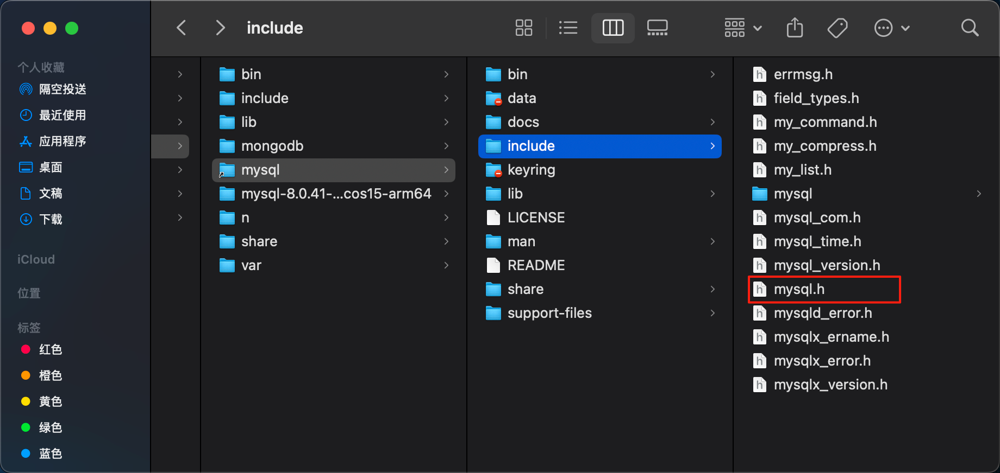

# mac 环境 安装 `mysqlclient` 报错


```$ pip install python-docx```
```bash
Collecting mysqlclient
  Using cached mysqlclient-2.2.7.tar.gz (91 kB)
  Installing build dependencies ... done
  Getting requirements to build wheel ... done
  Preparing metadata (pyproject.toml) ... done
Building wheels for collected packages: mysqlclient
  Building wheel for mysqlclient (pyproject.toml) ... error
  error: subprocess-exited-with-error
  
  × Building wheel for mysqlclient (pyproject.toml) did not run successfully.
  │ exit code: 1
  ╰─> [80 lines of output]
      /private/var/folders/pq/y3w7bmkd7qz39tx_s_lswqjh0000gn/T/pip-build-env-venc970c/overlay/lib/python3.13/site-packages/setuptools/config/_apply_pyprojecttoml.py:82: SetuptoolsDeprecationWarning: `project.license` as a TOML table is deprecated
      !!
      
              ********************************************************************************
              Please use a simple string containing a SPDX expression for `project.license`. You can also use `project.license-files`. (Both options available on setuptools>=77.0.0).
      
              By 2026-Feb-18, you need to update your project and remove deprecated calls
              or your builds will no longer be supported.
      
              See https://packaging.python.org/en/latest/guides/writing-pyproject-toml/#license for details.
              ********************************************************************************
      
      !!
        corresp(dist, value, root_dir)
      /private/var/folders/pq/y3w7bmkd7qz39tx_s_lswqjh0000gn/T/pip-build-env-venc970c/overlay/lib/python3.13/site-packages/setuptools/config/_apply_pyprojecttoml.py:61: SetuptoolsDeprecationWarning: License classifiers are deprecated.
      !!
      
              ********************************************************************************
              Please consider removing the following classifiers in favor of a SPDX license expression:
      
              License :: OSI Approved :: GNU General Public License v2 or later (GPLv2+)
      
              See https://packaging.python.org/en/latest/guides/writing-pyproject-toml/#license for details.
              ********************************************************************************
      
      !!
        dist._finalize_license_expression()
      /private/var/folders/pq/y3w7bmkd7qz39tx_s_lswqjh0000gn/T/pip-build-env-venc970c/overlay/lib/python3.13/site-packages/setuptools/dist.py:759: SetuptoolsDeprecationWarning: License classifiers are deprecated.
      !!
      
              ********************************************************************************
              Please consider removing the following classifiers in favor of a SPDX license expression:
      
              License :: OSI Approved :: GNU General Public License v2 or later (GPLv2+)
      
              See https://packaging.python.org/en/latest/guides/writing-pyproject-toml/#license for details.
              ********************************************************************************
      
      !!
        self._finalize_license_expression()
      # Options for building extension module:
        extra_compile_args: ['-I/opt/homebrew/opt/mysql-client/include', '-std=c99']
        extra_link_args: ['-L/opt/homebrew/opt/mysql-client/lib']
        define_macros: [('version_info', (2, 2, 7, 'final', 0)), ('__version__', '2.2.7')]
      running bdist_wheel
      running build
      running build_py
      creating build/lib.macosx-10.13-universal2-cpython-313/MySQLdb
      copying src/MySQLdb/release.py -> build/lib.macosx-10.13-universal2-cpython-313/MySQLdb
      copying src/MySQLdb/cursors.py -> build/lib.macosx-10.13-universal2-cpython-313/MySQLdb
      copying src/MySQLdb/connections.py -> build/lib.macosx-10.13-universal2-cpython-313/MySQLdb
      copying src/MySQLdb/__init__.py -> build/lib.macosx-10.13-universal2-cpython-313/MySQLdb
      copying src/MySQLdb/times.py -> build/lib.macosx-10.13-universal2-cpython-313/MySQLdb
      copying src/MySQLdb/converters.py -> build/lib.macosx-10.13-universal2-cpython-313/MySQLdb
      copying src/MySQLdb/_exceptions.py -> build/lib.macosx-10.13-universal2-cpython-313/MySQLdb
      creating build/lib.macosx-10.13-universal2-cpython-313/MySQLdb/constants
      copying src/MySQLdb/constants/FLAG.py -> build/lib.macosx-10.13-universal2-cpython-313/MySQLdb/constants
      copying src/MySQLdb/constants/CLIENT.py -> build/lib.macosx-10.13-universal2-cpython-313/MySQLdb/constants
      copying src/MySQLdb/constants/__init__.py -> build/lib.macosx-10.13-universal2-cpython-313/MySQLdb/constants
      copying src/MySQLdb/constants/ER.py -> build/lib.macosx-10.13-universal2-cpython-313/MySQLdb/constants
      copying src/MySQLdb/constants/CR.py -> build/lib.macosx-10.13-universal2-cpython-313/MySQLdb/constants
      copying src/MySQLdb/constants/FIELD_TYPE.py -> build/lib.macosx-10.13-universal2-cpython-313/MySQLdb/constants
      running egg_info
      writing src/mysqlclient.egg-info/PKG-INFO
      writing dependency_links to src/mysqlclient.egg-info/dependency_links.txt
      writing top-level names to src/mysqlclient.egg-info/top_level.txt
      reading manifest file 'src/mysqlclient.egg-info/SOURCES.txt'
      reading manifest template 'MANIFEST.in'
      adding license file 'LICENSE'
      writing manifest file 'src/mysqlclient.egg-info/SOURCES.txt'
      copying src/MySQLdb/_mysql.c -> build/lib.macosx-10.13-universal2-cpython-313/MySQLdb
      running build_ext
      building 'MySQLdb._mysql' extension
      creating build/temp.macosx-10.13-universal2-cpython-313/src/MySQLdb
      clang -fno-strict-overflow -Wsign-compare -Wunreachable-code -fno-common -dynamic -DNDEBUG -g -O3 -Wall -arch arm64 -arch x86_64 -I/opt/homebrew/opt/mysql-client/include "-Dversion_info=(2, 2, 7, 'final', 0)" -D__version__=2.2.7 -I/Library/Frameworks/Python.framework/Versions/3.13/include/python3.13 -c src/MySQLdb/_mysql.c -o build/temp.macosx-10.13-universal2-cpython-313/src/MySQLdb/_mysql.o -I/opt/homebrew/opt/mysql-client/include -std=c99
      src/MySQLdb/_mysql.c:29:10: fatal error: 'mysql.h' file not found
         29 | #include "mysql.h"
            |          ^~~~~~~~~
      1 error generated.
      error: command '/usr/bin/clang' failed with exit code 1
      [end of output]
  
  note: This error originates from a subprocess, and is likely not a problem with pip.
  ERROR: Failed building wheel for mysqlclient
Failed to build mysqlclient
error: failed-wheel-build-for-install

× Failed to build installable wheels for some pyproject.toml based projects
╰─> mysqlclient
```

`#include "mysql.h"`找不到

::: warning
查看安装的mysql头文件路径

export MYSQLCLIENT_CFLAGS="-I/usr/local/opt/mysql/include" 

export MYSQLCLIENT_LDFLAGS="-L/usr/local/opt/mysql/lib" 
:::



修改为正确的mysql.h文件路径重新执行
```bash
export MYSQLCLIENT_CFLAGS="-I/usr/local/mysql/include" 

export MYSQLCLIENT_LDFLAGS="-L/usr/local/mysql/lib" 

pip install mysqlclient
```

运行成功
